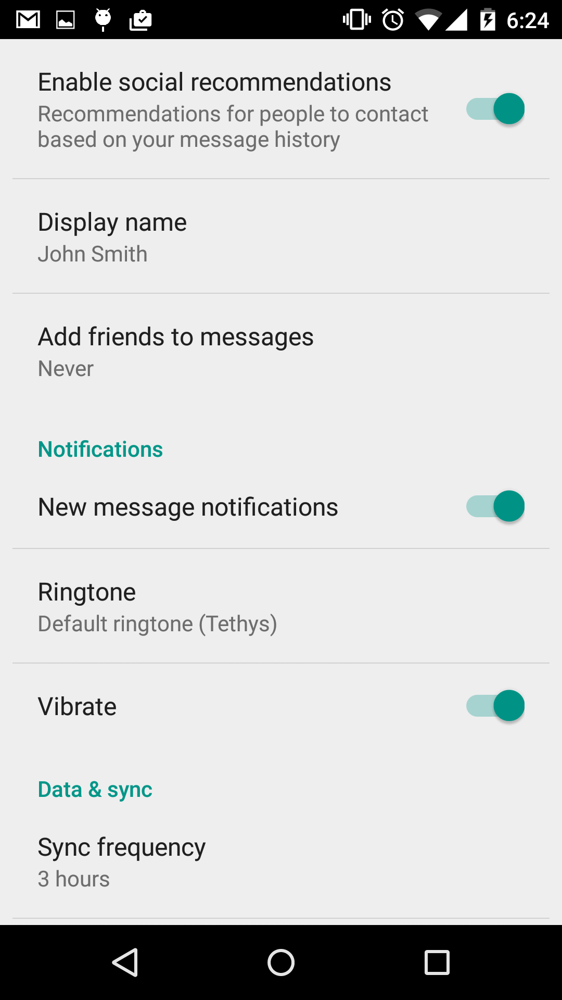

SwitchPreferenceCompat
======================

Allow easy to use [SwitchCompat](https://developer.android.com/reference/android/support/v7/widget/SwitchCompat.html) as preference.



Usage
=====

```xml
<CheckBox
    android:key="example_checkbox"
    android:title="@string/pref_title_example"
    android:summary="@string/pref_description_example"
    android:defaultValue="true" />
```

to

```xml
<com.cgollner.unclouded.preferences.SwitchPreferenceCompat
    android:key="example_checkbox"
    android:title="@string/pref_title_example"
    android:summary="@string/pref_description_example"
    android:defaultValue="true" />
```

Credit
======

* @ChristianGollner

This SwitchPreferenceCompat is imported from https://plus.google.com/+ChristianGollner/posts/badausxo1J6

* Preference class: https://gist.github.com/cgollner/5b31123c98b2c1cad8dc
* Layout resource: https://gist.github.com/cgollner/3c7fe2f9d34aee38bd0c
